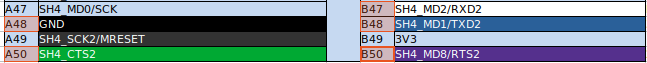

# JinGasa

## !! DISCLAIMER / WARNING / DANGER !!
* This is an **experimental**, Work-In-Progress BIOS, USE AT YOUR OWN RISK !!
* Don't blindly believe anything that's written here, verify everything for yourself, especially the voltage levels !!
* Not all things written here have been verified by me !!
* Not all register values have been cross-checked, so this BIOS might be setting some wrong values !!

## What ?
A [Kabuto](https://www.google.com/search?q=%E5%85%9C+%E4%BE%8D&tbm=isch) is a full-fledged [Samurai helmet](https://en.wikipedia.org/wiki/Kabuto).
* Kabuto is the codename for the (full-fledged) BIOS of the Dreamcast.

A [Jingasa](https://www.google.com/search?q=%E9%99%A3%E7%AC%A0&tbm=isch) is a [light helmet](https://en.wikipedia.org/wiki/Kasa_(hat)).
* JinGasa is an **experimental** minimalistic custom WIP BIOS that contains dcload-serial, for Naomi 1/2, System SP and SET5.

(Incidently, the Naomi & System SP Bios contain "Hat"-references: "NAOMIHAT" and "SPIDERHAT")

The only things JinGasa does are:
* init the strict necessary registers & vectors
* copy over [dcload-serial](https://github.com/KallistiOS/dcload-serial) to 0x8c010000
* jump to 0x8c010000

Hence, it only uses the SH-4 SCIF serial pins, not the MIE pins.

It's currently hardcoded to 32MB RAM in the source code (easy to change).

It also assumes VGA output.

Audio (AICA) is not initialized yet (TODO).

## Building
* To compile it, you need:
  * a file with the DC BIOS (preferably 1.01d), to extract the font 
  * a gcc compiler for sh-elf
  * download and compile [dcload-serial](https://github.com/KallistiOS/dcload-serial), so that /target-src/1st_read/loader.bin exists
* Build JinGasa.bin:
  * cd src
  * edit the Makefile to your paths !
  * make

## Burning
* To burn JinGasa.bin on a 2MB UV-eprom ST M27C160-100F1:
  * Erase the chip using an [eprom UV eraser](https://www.ebay.com/sch/i.html?_nkw=eprom+uv+eraser)
    * Depending on the UV eraser, you may need 15 to 30 minutes of erasure time.
  * Burn JinGasa.bin using an [eprom programmer](https://www.ebay.com/sch/i.html?_nkw=eprom+programmer)
    * Before buying a programmer, make sure the ST M27C160-100F1 is listed in the supported devices of that programmer !

## Naomi 1 variants
* Certain Naomi 1 boards (the later revisions) have 5 populated jumpers JP9 to JP13.
  * [cfr Mame source code](https://github.com/mamedev/mame/blob/087233e15b48c664427c44792f9b97c07892f2eb/src/mame/sega/naomi.cpp#L86C9-L86C9):
* This indicates that serial communication will also be possible via the CN8 connector on the filter board.
  * without: models 837-13707 (171-7772F/837-13544-01)
  * with: models 837-14351 (171-8183C) and 837-14601 (171-8183E).
* TODO: insert images

## Naomi 1 / 2
* The Naomi 1/2 exposes the SH-4 SCIF serial pins in 1 or 2 ways:
  * via the internal CN1 100-pin connector:
    * available on all Naomi 1 & 2
    * max baudrate: 1562500
    * CN1 pins (cfr [OzOnE's analysis](https://www.arcade-projects.com/threads/converting-gdrom-naomi-games-to-cart.1691/post-183676)):
    
    
    * Naomi 1 without JP9-JP13: CN1 SCIF works out-of-the-box, nothing special needed.
    * Naomi 1 with JP9-JP13: TODO, probably similar to Naomi2.
    * Naomi2: By default, RXD2 and CTS2 are disabled on CN1. To enable them, JP6 and JP7 should be populated / pins 1-2 should be connected, and the trace between pins 2-3 at the back of the board should be cut (RXD2 is linked to JP6-2, and CTS2 to JP7-2).

    
    * The connector is a [100-pin Omron XH3 connector](https://www.digikey.com/en/products/filter/arrays-edge-type-mezzanine-board-to-board/308?s=N4IgjCBcoBw1oDGUBmBDANgZwKYBoQB7KAbRADYB2AJkoBYQBdAgBwBcoQBlNgJwEsAdgHMQAXzEFqpIgFtehQQAIAHgAsAzEzFA)
  * via the external CN8 connector on the filter board:
    * available on all Naomi 2, but only on Naomi 1 that have JP9-JP13.
    * max baudrate: 390625
    * DANGER !
      * [According to Mame](https://github.com/mamedev/mame/blob/087233e15b48c664427c44792f9b97c07892f2eb/src/mame/sega/naomi.cpp#L90), the Naomi 2 uses **12V voltage levels** on CN8, while the Naomi 1 uses **3V3 voltage levels** ! I haven't checked this myself, since I don't have a Naomi 1 with RS-232 (TODO) !
    * Prerequisite:
      * set JP9 to JP13 to 2-3. ([cfr Mame source](https://github.com/mamedev/mame/blob/master/src/mame/sega/naomi.cpp))
        * Naomi1 with JP9-JP13: TODO
        * Naomi2: 
    * CN8 pins (Naomi2. Not verified on Naomi1 (TODO)):
      * 1,2,4,5 (RXD, TXD, RTS, CTS), 3 and 6 are GND ([cfr Arcade Projects source](https://www.arcade-projects.com/threads/naomi-2-chihiro-triforce-card-reader-emulator-initial-d3-wmmt-mario-kart-f-zero-ax.814/post-13129))
      
    * The CN8 connector is a [JST NH 6pin B6P-SHF-1AA](https://www.digikey.com/en/products/detail/jst-sales-america-inc/B6P-SHF-1AA/1885773?s=N4IgTCBcDaIEIDYAKBaAygCQGIoIwEF8QBdAXyA)
    * Naomi 2: seems to be connected to D4721 - NEC uPD4721GS RS-232 Line Driver/Receiver at 3.3V / 5V (TSSOP20), located at the opposite side of the filter board, near the fan ?

## System SP
* The System SP exposes the SH-4 SCIF serial pins in 2 ways:
  * via the CN11 100-pin connector:
    * max baudrate: TODO
    * CN11 pins - similar to the Naomi (cfr [OzOnE's analysis](https://www.arcade-projects.com/threads/converting-gdrom-naomi-games-to-cart.1691/post-183676)):

    
    * The connector is a [100-pin Omron XH3 connector](https://www.digikey.com/en/products/filter/arrays-edge-type-mezzanine-board-to-board/308?s=N4IgjCBcoBw1oDGUBmBDANgZwKYBoQB7KAbRADYB2AJkoBYQBdAgBwBcoQBlNgJwEsAdgHMQAXzEFqpIgFtehQQAIAHgAsAzEzFA)
  * via the CN16 connector:
    * currently not working/not verified, because the nEN pin of the ADM3222 is at 3.3V = disabled. Investigation needed to see how to enable this (TODO).
    * max baudrate: 390625 (ADM3222 is rated at max 460 kbps)
    * DANGER !
      * Requires **RS232 signal-level (typically 9-12V)** on the pins !
    * CN16 pins:
      * 1-4 (TXD, RXD, RTS, CTS), 5 and 10 are GND
      
    * The CN16 connector is a [JST NH 10pin BS10P-SHF-1AA](https://www.digikey.com/en/products/detail/jst-sales-america-inc/BS10P-SHF-1AA-LF-SN/9954068?s=N4IgTCBcDaIEIGUCMAGACgWgQCQGIaQEFCQBdAXyA)
* [Mame System SP info](https://github.com/mamedev/mame/blob/master/src/mame/sega/segasp.cpp)
## Katana SET5
* The SET5 exposes the SH-4 SCIF serial pins via the Modem board, to the external connector marked "SERIAL"
  * This is a regular RS232 (12V) output
  * Max baudrate: 520833
    * Faster speeds probably possible by bypassing the modem, and connecting directly to the SET5 motherboard.
* JinGasa is currently hardcoded to work with 32MB RAM, so if your SET5 only has 16MB RAM, adapt SH4_stack_init in [SH4.s](src/SH4.s) to 16MB.

## Connection to your USB-Serial adapter
* Connect the Naomi/System SP pins to your USB-Serial adapter like this:
  * GND <-> GND
  * TXD <-> RXD
  * RXD <-> TXD
  * RTS <-> CTS
  * CTS <-> RTS
* If you need to connect it to a 12V RS232 male connector, this is the pinout of that male connector, viewed from the front:

## SH-4 Baudrates
* To obtain the most optimal serial communication between the SH-4 cpu and your PC, you need to:
  * use a USB-Serial chip that can generate baudrates as close as possible to the SH-4 baudrates
  * select a baudrate that matches the SH-4 baudrates as close as possible
* The baudrates the SH-4 can generate, are:
  * Up until 115200, you can use the common baudrates: 9600, 19200, 38400, 57600, 115200.
    * Note about 115200: In fact, the SH-4 can only generate 111607 or 120192, but since 115200 is only a 3.22% deviation from 111607, 115200 usually works. 111607 or 120192 might give better results though.
  * Higher baudrates: 223214, 260416, 312500, 390625, 520833, 781250, 1562500.
  * Not recommended: 
230400 (11.53%), 460800 (11.53%), 500000 (4.00%), 576000 (26.27%), 921600 (41.02%), 1000000 (36.00%), 1152000 (26.27%), 1500000 (4.00%).
      * The deviation % compared to the SH-4 supported baudrates are mentioned between () here above. A deviation of 2-3% usually works, but a deviation of 4 % only works on specific chips (aka chip luck).
* The most compatible chip known today is the [Silicon Labs CP2102N](https://www.silabs.com/interface/usb-bridges/usbxpress), it supports all SH-4 baudrates up to 1562500.
  * TTL level (3.3V):
    * eg [Adafruit CP2102N Friend (USB-C)](https://www.adafruit.com/product/5335)
    * eg [Silicon Labs CP2102N-MINIEK (mini USB)](https://www.silabs.com/development-tools/interface/cp2102n-mini-development-kit?tab=overview)
    * eg [DSD TECH SH-U09BL USB to TTL Serial Cable with CP2102N Chip](https://www.amazon.co.uk/DSD-TECH-SH-U09BL-Serial-CP2102N/dp/B08JLRP6YV)
  * RS232 level (12V):
    * eg [Silicon Labs CP2102N-EK Development Kit](https://www.silabs.com/development-tools/interface/cp2102n-development-kit?tab=overview)
* FTDI FT232R-like chips are not really recommended, they are good until 781250, but they do NOT support 1562500 (only 1500000, hence you'll depend on chip luck).

## Big Thanks to
* [Colton](https://github.com/cepawiel) for all the good tips during this project, and for finding the Naomi2's JP6-JP7 functionality.
* OzOnE for the [Naomi pinouts](https://www.arcade-projects.com/threads/converting-gdrom-naomi-games-to-cart.1691/post-183676)
* [Mame](https://www.mamedev.org/index.php) for all the low-level info
* The open source Dreamcast SDK [KallistiOS](https://github.com/KallistiOS)
* DragonMinded's [NaomiDev](https://dragonminded.com/naomidev/) and [libnaomi](https://dragonminded.com/naomidev/libnaomi/) pages & [source code](https://github.com/DragonMinded/libnaomi)
* The good people of the [Simulant Discord](https://discord.gg/TRx94EV)

## Other Interesting Links
* [Dreamcast Coder's Cable](https://dreamcast.wiki/Coder%27s_cable)
